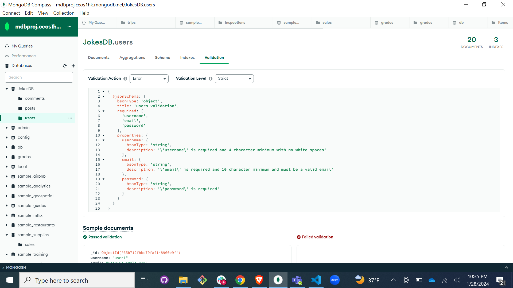

# SBA 319: MongoDB Database Application

Version 1.0, 08/01/23
[Click here](https://github.com/HichamBenkada/MongoDB_SBA) to open GitHub Repository

## Validator:

## Introduction:

This project is to create a small Node, Express, and MongoDB server application that measures my understanding of MongoDB and my capability to implement its features in a practical manner. 

## Objectives

- Create a server application with Node, Express, and MongoDB.
- Create a CRUD API using Express and MongoDB.
- Create MongoDB indexes.
- Use MongoDB indexing to make efficient queries.
- Create MongoDB validation rules.
- Use MongoDB validation to ensure data consistency.

## Content:
#### _db Folder_ :
This folder contains the users,posts, and comments database collections used for the project.
#### _Models folder_ : 
This folder contains mongoose model for each collection. 
#### _routes_ : 
This folder contains seed, users, jokes, and comments routes used for the api of the application:
 - _seed_ : is used to generated the collections in your local mongoDB collection
 - _users_: is used to implement CRUD on users API, including:
     - GET '/api/users' : Read all users of the collection
     - Post '/api/users' : Create a user into the collection
     - GET '/api/users/:id' : Get user by id
     - PATCH '/api/users/:id' : Update user with the provided id
     - Delete '/api/users/:id' : Delete user of the provided id
 - _jokes_: is used to implement CRUD on jokes API, including:
     - GET '/api/jokes' : Read all jokes of the collection
     - Post '/api/jokes' : Create a joke into the collection
     - GET '/api/jokes/:id' : Get joke by id
     - PUT '/api/jokes/:id' : Update joke with the provided id
     - Delete '/api/jokes/:id' : Delete joke of the provided id
     - GET '/api/jokes/:userId' : Get joke of the provided user
- _comments_: is used to implement CRUD on comments API, including:
     - GET '/api/comments' : Read all comments of the collection
     - Post '/api/comments' : Create a new comment into the collection
     - GET '/api/comments/:id' : Get comment by id
     - PATCH '/api/comments/:id' : Update comment with the provided id
     - Delete '/api/comments/:id' : Delete comment of the provided id
     - GET '/api/comments/:userId' : Get comment of the provided user

### Completion

the completted github repository of the project is submitted to Canvas.

_Thank you for your time! looking forward to hear your comments and feedback to develop and make this project better_

